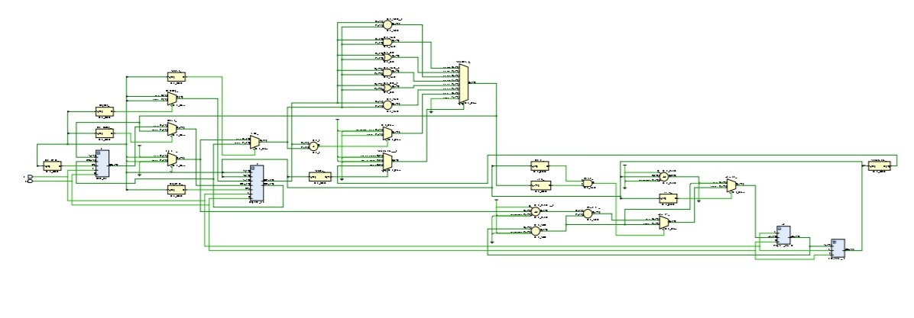

# 🖥️ Single Cycle MIPS Processor (Verilog)

## 📌 Overview
This project implements a **Single-Cycle MIPS Processor** using Verilog HDL.  
The processor executes each instruction in a single clock cycle and supports arithmetic, memory, branch, and jump operations.

---

## 🧠 Architecture

### 🔷 Datapath Schematic

### 🔷 Components
- Program Counter (PC)
- Instruction Memory
- Register File (32 registers)
- ALU (Arithmetic Logic Unit)
- Data Memory
- Control Unit
- Sign Extension & Multiplexers

---

## ⚙️ Features
- **R-type Instructions:** `add`, `sub`, `and`, `or`, `slt`
- **I-type Instructions:** `lw`, `sw`, `addi`, `beq`
- **J-type Instruction:** `jump`
- 32-bit datapath architecture
- Separate instruction and data memory
- Fully functional control unit and ALU control

---

## 🧪 Simulation
- Simulated using **Xilinx Vivado**
- Verified using testbench (`MIPS_tb.v`)

### ✔ Verified Operations
- Arithmetic operations (ADD, SUB, AND, OR, SLT)
- Memory access (LW, SW)
- Control flow (BEQ, JUMP)
- PC update and branching behavior

---

---

## 📄 File Descriptions

### 🔷 Verilog Source Files

- **Single_Cycle_MIPS.v**  
  Top-level module integrating datapath and control logic.

- **Program_Counter.v**  
  Updates instruction address on each clock cycle.

- **Instruction_mem.v**  
  Stores instructions and provides them based on PC.

- **Register_File.v**  
  Implements 32 registers with read/write capability.

- **Data_Mem.v**  
  Handles memory read/write for `lw` and `sw`.

---

### 🔷 Testbench

- **MIPS_tb.v**  
  Simulates full processor execution and initializes memory.

---

### 🔷 Memory Files

- **Instruction_Mem.mem**  
  Contains machine code instructions executed by processor.

- **Register_File.mem**  
  Initializes register values before simulation.

- **Data_Mem.mem**  
  Provides initial data for memory operations.

- **truth_table.mem**  
  Default instruction memory (overridden during simulation).

---

## 🎯 Learning Outcomes
- Understanding of MIPS architecture  
- Datapath and control unit design  
- Verilog-based processor implementation  
- Simulation and debugging in Vivado  

---

## 👨‍💻 Author
Harsh Kumar
